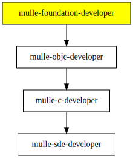

# mulle-foundation-developer

#### 👑 Objective-C development with the MulleFoundation and mulle-sde

This is a collection of [mulle-sde](//github.com/mulle-sde)
*extensions* to support development of [MulleFoundation](//github.com/MulleFoundation)
code.


## Usage


### Create an Objective-C executable project

```
mkdir foo
cd foo
mulle-sde init -m mulle-foundation/objc-developer executable
```

### Create an Objective-C library project

```
mulle-sde init -m mulle-foundation/objc-developer -d foolib library
```


Extension                       | Type | Description
--------------------------------|------|----------------------------
mulle-foundation/objc-developer | meta | Create Objective-C projects


### You are here




## Install

Install [foundation-developer](//github.com/MulleFoundation/foundation-developer) and
mulle-foundation-developer will part of the deal. 

> If you really want just mulle-foundation-developer,
> examine the "Script" approach and reduce the `OTHER_PROJECTS`.

## Author

[Nat!](https://mulle-kybernetik.com/weblog) for Mulle kybernetiK  


